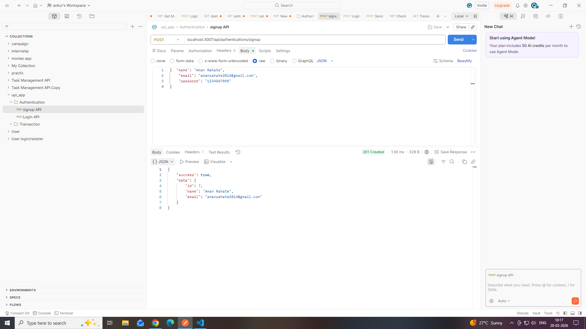
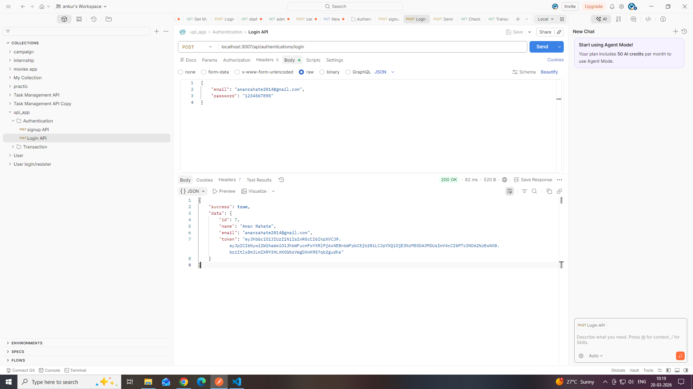
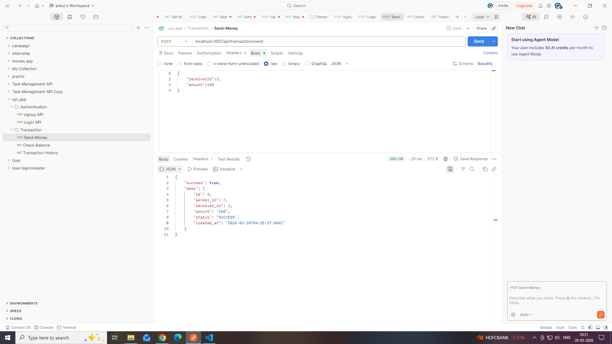
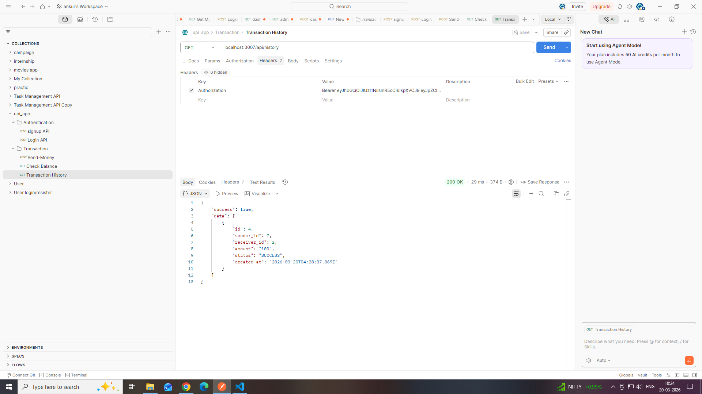

🚀 UPI Backend System (Node.js + PostgreSQL)

📌 Project Overview

This project is a secure and scalable UPI-based transaction backend system built using Node.js (Express.js) and PostgreSQL.

It supports user authentication, account management, and real-time money transfer with proper database transactions and error handling.

---

⚙️ Tech Stack

- Backend: Node.js, Express.js
- Database: PostgreSQL
- Authentication: JWT (JSON Web Token)
- Password Hashing: bcrypt
- Database Driver: pg

---

🧠 Features

🔐 Authentication & Authorization

- User Signup
- User Login
- JWT-based authentication
- Protected routes using middleware

---

💰 UPI Transaction Features

- ✅ Send Money (with DB transaction: BEGIN / COMMIT / ROLLBACK)
- ✅ Check Account Balance
- ✅ Transaction History (sent & received)
- ✅ Failed transaction logging

---

🛡️ Security & Best Practices

- Input validation at controller level
- Password hashing using bcrypt
- JWT authentication for secure endpoints
- SQL Injection prevention using parameterized queries
- Proper error handling with global error handler
- Row-level locking using "FOR UPDATE"

---

🗄️ Database Design

Tables:

👤 Users

- id
- name
- email
- password

🏦 Accounts

- id
- user_id (FK)
- balance

💸 Transactions

- id
- sender_id
- receiver_id
- amount
- status (SUCCESS / FAILED)
- created_at

---

🔁 API Endpoints

🔐 Auth APIs

Signup

POST /api/authentications/signup

Login

POST /api/authentications/login

---

💰 Transaction APIs

Send Money

POST /api/transactions/send

Headers:
Authorization: Bearer TOKEN

Body:
{
"receiverId": 2,
"amount": 100
}

---

💳 Account APIs

Get Balance

GET /api/account/balance

Headers:
Authorization: Bearer TOKEN

---

📜 Transaction History

Get All Transactions

GET /api/history

Headers:
Authorization: Bearer TOKEN

---

🔄 Transaction Flow

1. Start DB transaction ("BEGIN")
2. Lock sender & receiver rows using "FOR UPDATE"
3. Validate balance
4. Deduct & add balance
5. Insert transaction (SUCCESS)
6. Commit transaction

❌ If error:

- Rollback transaction
- Save FAILED transaction separately

---

## ⚡ Project Structure

```
src/
├── config/
├── controllers/
├── services/
├── middleware/
├── routes/
├── app.js
└── server.js
```

---

🧪 How to Run

1️⃣ Install dependencies

npm install

### 2️⃣ Setup environment variables (.env)

```env
PORT=3000
DATABASE_URL=your_postgres_url
JWT_SECRET=your_secret_key
ENV=development
```

3️⃣ Start server

npm start

---

## 📸 Screenshots

### 🔹 Signup API


### 🔹 Login API


### 🔹 Send Money


### 🔹 Balance


### 🔹 Transaction History


---

📌 Assumptions

- Each user has one account
- Initial balance is set to 1000
- Transactions are atomic using DB transactions
- No frontend included (backend-only system)

---

🚀 Future Improvements

- Add pagination for transaction history
- Add rate limiting
- Add request validation using Joi/Zod
- Add refresh tokens
- Add UPI ID system

---

👨‍💻 Author

Ankur Rahate
Backend Developer (Node.js)

---

✅ Conclusion

This project demonstrates:

- Strong backend fundamentals
- Database transaction handling
- Secure API development
- Clean and modular architecture

---

⭐ Thank you for reviewing this project!
